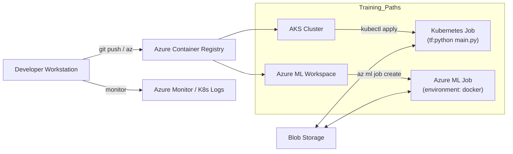

# Azure TensorFlow Cloud Starter 🚀


[](#)

A clean, production-ready template to run **TensorFlow** training/inference on **Microsoft Azure** using containerized jobs.  
Designed to be simple, auditable, and cloud-agnostic in structure — inspired by the ethos of [`tensorflow/cloud`](https://github.com/tensorflow/cloud) while targeting Azure services.

> ✅ **Redaction notice:** This repository contains **no secrets, IP addresses, tenant IDs, or organization identifiers**. All parameters use safe placeholders (e.g., `<SUBSCRIPTION_ID>`, `<ACR_NAME>`).

---

## 🧭 What you get

- **Professional docs**: RUNBOOK, ARCHITECTURE, SECURITY, CUTOVER & ROLLBACK checklists.
- **Automation-ready scripts**: Bash + PowerShell to provision Azure resources and submit jobs.
- **Manifests**: Azure ML job YAML and Kubernetes Job for AKS.
- **Clean `.gitignore`** and consistent Markdown formatting.

---

## 🧩 Architecture (at a glance)



Two supported execution paths:
1. **Azure ML (recommended)** for orchestration, tracking, and managed compute.
2. **AKS Kubernetes Job** for simple, direct container execution.

---

## 🔁 Lifecycle Stages

1. **Plan** → pick AML vs AKS, decide image base, set quotas.
2. **Build** → containerize your TF code (`Dockerfile`), version tag, push to ACR.
3. **Provision** → create ACR, AKS or AML workspace (scripts provided).
4. **Configure** → set env vars, dataset mounts, secrets in Key Vault (not in git).
5. **Execute** → submit job (AML or AKS).
6. **Observe** → watch logs/metrics; capture artifacts.
7. **Cutover** → promote model/image to prod tags.
8. **Rollback** → revert to previous tag / job definition.
9. **Harden** → apply Security.md items (RBAC, private endpoints, policies).

---

## 🏃 Quickstart

```bash
# 1) Configure your session
az login
az account set --subscription <SUBSCRIPTION_ID>

# 2) Create core resources (ACR + AKS minimal) - bash
./scripts/azure/create-acr-aks.sh

# 3) Build and push your TensorFlow image
./scripts/docker_build_and_push.sh

# 4a) Submit via Azure ML
az extension add -n ml -y
./scripts/azureml/submit-job.sh

# 4b) Or submit to AKS with kubectl
./scripts/kubernetes/submit-job.sh
```

> ℹ️ Replace placeholders (`<RESOURCE_GROUP>`, `<ACR_NAME>`, `<AKS_NAME>`, etc.) in `configs/sample.env` or export them in your shell.

---

## 🛡️ Redaction badge & statement

- Badge above is generated by shields.io to indicate this repo is intentionally **redacted**.
- We commit **no** credentials, keys, IPs, tenant or subscription IDs. Use **Azure Key Vault** or environment variables.
- Example secrets to **avoid** committing: service principals, SAS tokens, kubeconfigs, AML datastore keys.

---

## 📚 Documentation Map

- [`RUNBOOK.md`](./RUNBOOK.md) – step-by-step operations
- [`docs/OVERVIEW.md`](./docs/OVERVIEW.md) – concise intro
- [`docs/ARCHITECTURE.md`](./docs/ARCHITECTURE.md) – diagrams + components
- [`docs/SECURITY.md`](./docs/SECURITY.md) – guardrails & policies
- [`docs/CUTOVER_CHECKLIST.md`](./docs/CUTOVER_CHECKLIST.md) – promote to prod
- [`docs/ROLLBACK.md`](./docs/ROLLBACK.md) – safe revert procedure

---

## 📦 Contents

```
.
├── README.md
├── RUNBOOK.md
├── .gitignore
├── configs/
│   └── sample.env
├── scripts/
│   ├── azure/
│   │   ├── create-acr-aks.sh
│   │   └── create-acr-aks.ps1
│   ├── azureml/
│   │   └── submit-job.sh
│   ├── kubernetes/
│   │   └── submit-job.sh
│   └── docker_build_and_push.sh
└── manifests/
    ├── azureml/
    │   └── tf-train-job.yml
    └── kubernetes/
        └── tf-job.yaml
```

---

## 🧪 Local development

- Create a Python venv, install TensorFlow and your project deps.
- Develop your training script (e.g., `train.py`) and mount it into the container or bake into the image.
- Use small test epochs/steps locally; scale on cloud.

---

## 📄 License & attribution

Use with your preferred license. Inspired by ideas from the TensorFlow ecosystem; this starter targets **Azure** workflows.
