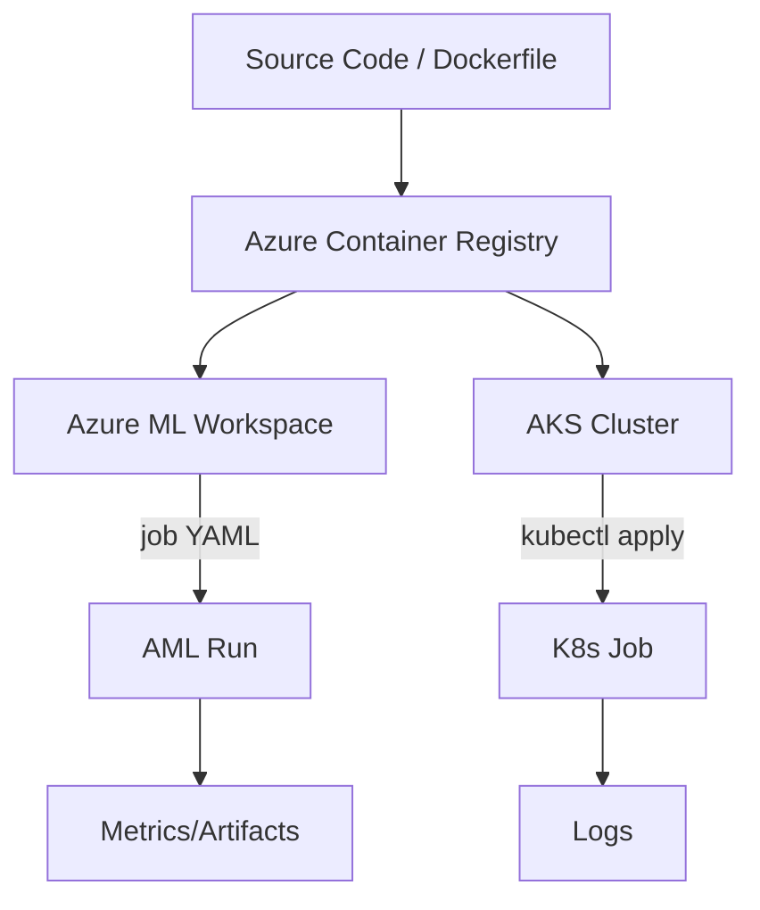

# ARCHITECTURE

```mermaid
graph TD
  A[Source Code / Dockerfile] --> B[Azure Container Registry]
  B --> C[Azure ML Workspace]
  B --> D[AKS Cluster]
  C -->|job YAML| E[AML Run]
  D -->|kubectl apply| F[K8s Job]
  E --> G[Metrics/Artifacts]
  F --> H[Logs]
```
**Key components:** ACR, AML (optional), AKS, Blob Storage, Key Vault.

**Images:** Use TensorFlow base images or custom CUDA-enabled images when running on GPU nodes.
